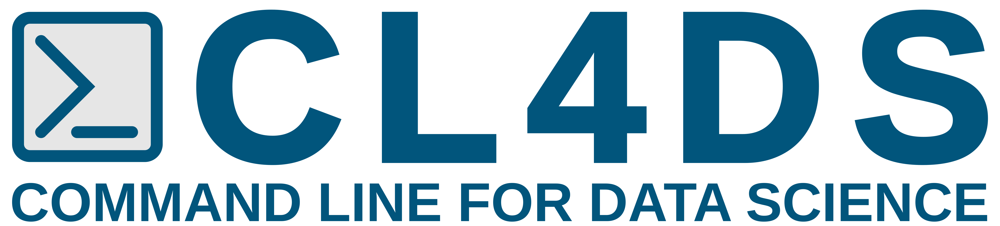

   

<h3 align="center">Una colección de manuales, recursos, webs, software y herramientas CLI y más.</h3>

 

**Version and Activity**

  
  
   
  </a>

 

**Analysis**

 

**Social Media**

  

****

<!--
https://docs.github.com/es/get-started/writing-on-github/getting-started-with-writing-and-formatting-on-github/basic-writing-and-formatting-syntax#alerts
-->

# Command Line for Data Science (CL4DS)

## Introducción

 Este libro, _Data Science at the Command Line_, me ha gustado siempre por su enfoque. No trata sobre metodologías en Data Science ni conceptos estadísticos profundos pero da herramientas, consejos y ejemplos concretos para llevar a cabo tareas fundamentales de manera eficiente utilizando la línea de comandos. Es un libro práctico que se enfoca en la implementación efectiva, lo que lo convierte en un recurso valioso para aquellos que buscan mejorar sus habilidades prácticas en el ámbito de Data Science.

Este libro me ha ayudado mucho y es el que ha servido de inspiración para iniciar este repositorio que tiene como finalidad ser un espacio de aprendizaje dedicado a la intersección entre Data Science y el uso eficiente de programas mediante línea de comandos.

La Ciencia de Datos ha transformado la manera en que abordamos la información y extraemos conocimientos significativos de los datos. A través de análisis, visualizaciones y modelado, hemos obtenido una comprensión más profunda del mundo que nos rodea. En este contexto, me gustaría que CL4DS sea un recurso interesante para aquellos que desean avanzar en este campo, aprovechando al máximo las capacidades de la línea de comandos. En este repositorio, podréis encontraros una amplia gama de manuales, recursos y materiales. Estos recursos están diseñados para la aplicación de conceptos y técnicas de Ciencia de Datos mediante la línea de comandos.

Este repositorio está destinado a la interacción y el crecimiento colaborativo. Sois libres de explorar, cuestionar y compartir vuestros conocimientos.

Mi finalidad es generar manuales de `awk`, `sed`, `nbconvert`, `csvkit`, ... con explicaciones sencillas, recursos útiles y muchos ejemplos. Así como el ir descubriendo entre todos otras herramientas interesantes de línea de comando.

## Explorando el Repositorio CL4DS: Manuales Detallados para Herramientas de Data Science

En este repositorio se desarrollará una colección de manuales de herramientas basadas en línea de comandos útiles en el campo de la Ciencia de Datos, desde bibliotecas de programación y funciones hasta aplicaciones especializadas. Mi intención es que cada manual proporcione instrucciones detalladas sobre cómo utilizar estas herramientas de manera efectiva y eficiente.

Mi propósito es que este repositorio sea estático; está diseñado para crecer y evolucionar con el tiempo. Mi compromiso es mantener este espacio con recursos actualizados. A medida que el campo de la Ciencia de Datos continúa desarrollándose, también lo hará esta colección de manuales.

En principio, los manuales estarán escritos en markdown y desarrollaré scripts y makefiles para poder exportar dichos manuales a otros formatos: pdf, html vía mkdocs, ...

### Introducción a AWK

AWK es un lenguaje de programación versátil diseñado para el procesamiento y transformación de textos y datos tabulares. Su nombre deriva de las iniciales de sus creadores: [Aho, Alfred](https://en.wikipedia.org/wiki/Alfred_Aho), [Weinberger, Peter](https://en.wikipedia.org/wiki/Peter_J._Weinberger) y [Kernighan, Brian](https://en.wikipedia.org/wiki/Brian_Kernighan). AWK permite realizar una variedad de tareas, desde la extracción y manipulación de campos y registros en archivos hasta cálculos complejos y generación de informes. Su sintaxis simple pero poderosa lo convierte en una herramienta esencial en el kit de cualquier desarrollador o analista de datos.

En este manual, exploraremos los fundamentos de AWK, desde los conceptos básicos de su estructura hasta su aplicación en situaciones del mundo real. Aprenderemos a utilizar patrones y acciones para filtrar y transformar datos, así como a crear scripts más avanzados para automatizar tareas repetitivas. Si deseas profundizar en el procesamiento de texto y datos tabulares mediante AWK, estás en el lugar correcto.

> [!NOTE]
> Para obtener más información sobre AWK, puedes visitar el [proyecto oficial de AWK en GitHub](https://github.com/onetrueawk/awk).

<b>Esquema para el Manual de AWK</b>

 

1. Introducción a AWK
   - ¿Qué es AWK y por qué es importante?
   - Historia y contexto de AWK.

2. Fundamentos de AWK
   - Estructura básica de un comando AWK.
   - Patrones y acciones.
   - Variables predefinidas en AWK.

3. Manipulación de Campos y Registros
   - Extracción y manipulación de campos.
   - Uso de delimitadores y separadores.
   - Concatenación y formateo de datos.

4. Filtrado y Transformación de Datos en AWK
   - Uso de patrones para filtrar registros.
   - Aplicación de acciones para transformar datos.
   - Ejemplos de filtrado y transformación.

5. Trabajo con Archivos Externos
   - Lectura y escritura de archivos.
   - Procesamiento de múltiples archivos.
   - Ejemplos de lectura y escritura de archivos.

6. Scripts AWK Avanzados
   - Estructura de un script AWK.
   - Funciones y bloques de código.
   - Automatización de tareas con scripts.

7. Casos de Uso Prácticos
   - Análisis de registros de registro.
   - Procesamiento de archivos de registro.
   - Generación de informes personalizados.

8. Recursos y Consejos para Trabajar con AWK
   - Optimización de rendimiento.
   - Estilo de codificación y legibilidad.
   - Recursos adicionales para aprender AWK.

### Introducción a nbconvert

nbconvert es una poderosa herramienta diseñada para convertir notebooks de Jupyter en una variedad de formatos de salida, permitiendo a los usuarios compartir y publicar su trabajo de manera efectiva. Los notebooks de Jupyter son documentos interactivos que combinan texto enriquecido, código, visualizaciones y resultados en un único entorno. Sin embargo, para compartir estos documentos con audiencias diversas, es esencial convertirlos en formatos más accesibles y legibles, como HTML, PDF, Markdown u otros.

> [!NOTE]
> Si deseas obtener más información sobre nbconvert, puedes consultar la [documentación oficial de nbconvert](https://nbconvert.readthedocs.io/en/latest/) o entrar en el [repositorio de GitHub de nbconvert](https://github.com/jupyter/nbconvert)

<b>Esquema para el Manual de nbconvert</b>

 

1. Introducción
   - ¿Qué es nbconvert?
   - Ventajas de usar nbconvert
   - Requisitos previos

2. Instalación
   - Instalación de nbconvert
   - Comprobación de la instalación

3. Uso Básico
   - Conversión de un notebook a otro formato
   - Opciones de línea de comandos comunes
   - Conversión por lotes

4. Opciones Avanzadas
   - Uso de tags
   - Personalización de las plantillas
   - Manipulación de metadatos
   - Uso de preprocesadores y postprocesadores

5. Integración con Jupyter
   - Uso de nbconvert desde Jupyter Notebook
   - Exportación desde Jupyter Lab

6. Solución de Problemas
   - Mensajes de error comunes y soluciones
   - Recursos para obtener ayuda adicional

7. Apéndices
   - Referencia de comandos y opciones
   - Ejemplos de uso avanzado
   - Casos de uso específicos

8. Glosario
   - Términos y conceptos clave

9. Bibliografía
   - Referencias y enlaces útiles

### Introducción a csvkit

csvkit es una suite de herramientas diseñada específicamente para trabajar con archivos CSV (valores separados por comas) de manera eficiente. Manipular datos en formato CSV puede ser complicado, especialmente cuando se trata de limpiar, filtrar y transformar grandes conjuntos de datos. csvkit simplifica este proceso al proporcionar un conjunto de comandos de línea de comandos que permiten realizar tareas comunes en archivos CSV de manera sencilla y efectiva.

En este manual, exploraremos las capacidades de csvkit para realizar operaciones como la conversión entre formatos CSV y otros formatos de datos, la unión de archivos CSV, la selección y filtrado de columnas, y mucho más. Aprenderemos cómo aprovechar al máximo estas herramientas para agilizar el flujo de trabajo con datos tabulares.

> [!NOTE]
> Si deseas obtener más información sobre csvkit, puedes consultar el [proyecto oficial de csvkit en GitHub](https://github.com/wireservice/csvkit) o leer la [documentación oficial de csvkit](https://csvkit.readthedocs.io/en/latest/)

<b>Esquema para el Manual de csvkit</b>

 

1. Introducción a csvkit
   - ¿Qué es csvkit y por qué es útil?
   - Importancia de trabajar con archivos CSV.

2. Configuración y Primeros Pasos
   - Instalación de csvkit.
   - Visión general de las herramientas disponibles.
   - Lectura y visualización de archivos CSV.

3. Operaciones Básicas con csvkit
   - Conversión entre formatos de archivo.
   - Selección y filtrado de columnas.
   - Ordenamiento de datos en CSV.

4. Unión y Combinación de Datos
   - Combinación de múltiples archivos CSV.
   - Uso de claves para la unión de datos.
   - Manejo de duplicados y valores faltantes.

5. Limpieza y Transformación de Datos
   - Eliminación de espacios en blanco y caracteres no deseados.
   - Cambio de formato de datos.
   - Normalización y estandarización.

6. Análisis y Exploración de Datos
   - Cálculos estadísticos básicos.
   - Resumen y agregación de datos.
   - Generación de gráficos y visualizaciones.

7. Automatización de Tareas con csvkit
   - Uso de scripts y comandos en secuencias.
   - Integración con flujos de trabajo de línea de comandos.
   - Ejemplos de automatización.

8. Casos de Uso Prácticos
   - Procesamiento de datos de encuestas.
   - Análisis de datos de ventas.
   - Preparación de datos para análisis posterior.

9. Recursos y Consejos para Trabajar con csvkit
   - Enlaces a la documentación oficial de csvkit.
   - Tutoriales y ejemplos adicionales.
   - Comunidad y soporte.

## Más Información

Iré añadiendo recursos que haya ido encontrando mientras desarrollo los manuales que me parezcan interesantes.

### AWK

  * [Filtro: awk, grep, sed y cut](https://atareao.es/tutorial/terminal/filtros-awk-grep-sed-y-cut/)
  * [Curso avanzado de programación AWK y Bash para bioinformática y biocómputo en sistemas GNU/Linux](https://vinuesa.github.io/intro2linux/index.html)
  * [Introducción a AWK | pdf](https://www.um.es/innova/OCW/informatica-para-universitarios/ipu_docs/la_shell/awk.pdf)
  * [Uso del comando AWK en Linux y UNIX con ejemplos](https://geekland.eu/uso-del-comando-awk-en-linux-y-unix-con-ejemplos/)
  * [Process Multiple Input Files Using Awk](https://www.baeldung.com/linux/awk-multiple-input-files)
  * [Uso del comando AWK en Linux y UNIX con ejemplos](https://geekland.eu/uso-del-comando-awk-en-linux-y-unix-con-ejemplos/)

### csvkit

  * [csvkit, a command-line tool for reporters](https://github.com/utdata/csvkit-nicar)

### nbconvert

  * [nbconvert: Convert Notebooks to other formats](https://nbconvert.readthedocs.io/en/latest/)
  * [nbconvert en GitHub](https://github.com/jupyter/nbconvert)
  * [Converting notebooks to other formats](https://ipython.org/ipython-doc/2/notebook/nbconvert.html)

## Contribución

> [!IMPORTANT]
> Si encuentras algo que no tenga sentido o que no parezca correcto, puedes realizar una solicitud de extracción (pull request) y agregando explicaciones válidas y bien razonadas sobre los cambios o comentarios.

Algunas reglas simples que me gustaría mantener para este proyecto:

  - Los cambios deben ser útiles
  - Los cambios deben ser interesantes
  - Los cambios deben ser claros

También se puede proponer crear nuevos manuales de otras herramientas.

## En Camino ...

| Nombre del Programa | Descripción | Dirección Web del Proyecto |
|---------------------|-------------|----------------------------|
| SQLite              | SQLite es una base de datos SQL ligera y autocontenida que se utiliza para almacenar, consultar y gestionar datos de forma eficiente. | [Sitio web de SQLite](https://www.sqlite.org/) |
| grep                | `grep` es una herramienta de línea de comandos utilizada para buscar patrones de texto en archivos y directorios. Es útil para buscar y extraer información de archivos de texto. | N/A |
| sed                 | `sed` (editor de secuencias) es una herramienta de línea de comandos para procesar y transformar texto. Se utiliza para realizar sustituciones y ediciones de texto en archivos. | N/A |
| curl                | `curl` es una herramienta de línea de comandos que permite realizar solicitudes HTTP y descargar datos desde la web. Puede utilizarse para acceder a APIs web y obtener datos. | [Sitio web de curl](https://curl.se/) |
| jq                  | `jq` es una herramienta de línea de comandos para procesar y manipular datos en formato JSON. Permite consultar, filtrar y transformar datos JSON de manera efectiva. | [Repositorio de jq en GitHub](https://github.com/stedolan/jq) [Sitio web de jq](https://jqlang.github.io/jq/) |

Algunos programas, como `grep` y `sed`, son herramientas de línea de comandos estándar disponibles en la mayoría de sistemas Unix y Linux, por lo que no tienen un sitio web de proyecto específico. Podemos encontrar más información sobre ellos en la documentación de nuestro sistema o utilizando la opción de ayuda (`--help`) desde la línea de comandos.
